Les mains dans la forge 

Dans ce TD, nous allons réaliser un ensemble de manipulations sur la forge GitLab en simulant des cas d'usage de la vie réelle.

# Table des matières
1. [Nouveau projet](#projet)
2. [Déclaration des droits et utilisateurs](#droits)
3. [Intégration continue](#ci)
4. [Développement](#planning)

# Nouveau projet 

Nous allons commencer par créer un nouveau projet GitLab qui va nous servir de support pour ce TD.

Je le nomme "configGitLab" et je le déclare pour un projet privé

Comme il n'y a aucun fichier source, GitLab ne m'affiche pas grand chose, donc je demande à créer le fichier README.md en utilisant l'éditeur en ligne

Une fois ce fichier crée, GitLab commence à m'afficher une page avec divers informations pratiques (nombre de commits , de branches, taille du stockage ...) et des raccourcis permettant notamment de configurer l'intégration continue. Nous y reviendrons plus tard. 

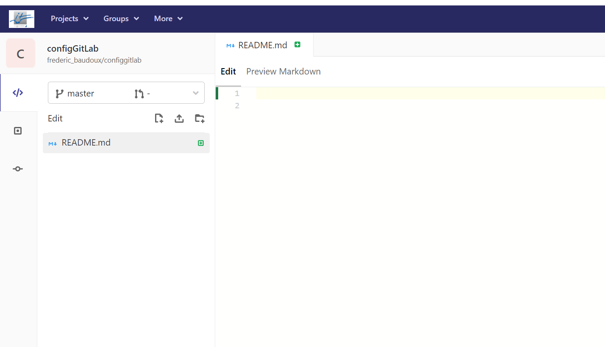

Pour le moment, nous allons nous intéresser un peu au menu de gauche. Dans ce menu, on va trouver toutes les fonctions mise à disposition par la forge pour notre projet. Il y en a trop pour être couvertes dans un seul TD, nous allons donc nous focaliser sur les plus utiles.

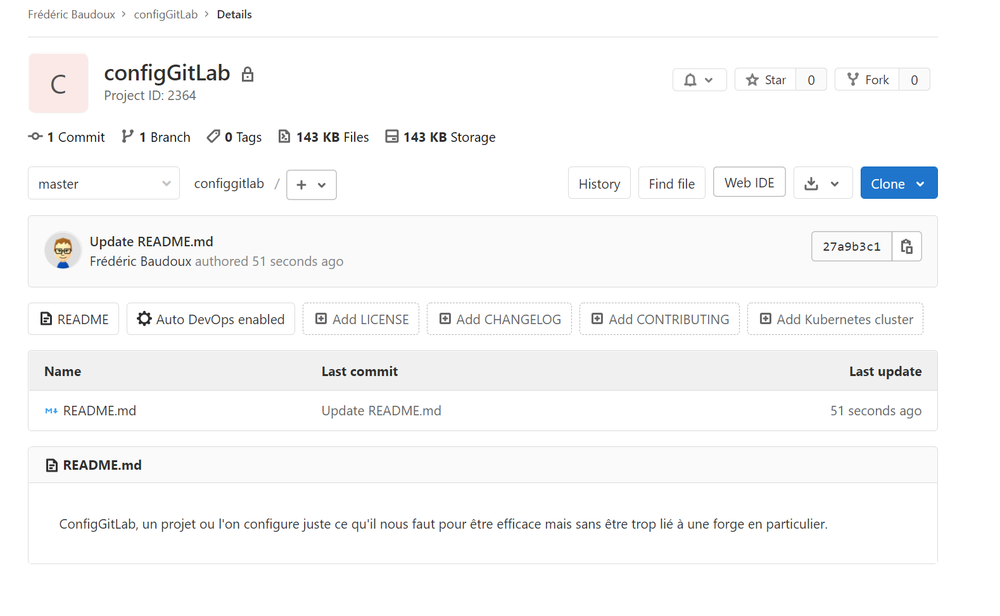

D'ailleurs, pour y voir plus clair, nous allons commencer par faire disparaitre quelques fonctions que nous n'utiliserons pas pour le moment.
Pour faire ça, on doit se rendre dans le menu "Settings"

On va retrouver divers rubriques. La rubrique "Général" nous permet de donner quelques informations supplémentaires sur le projet et de lui associer une icône

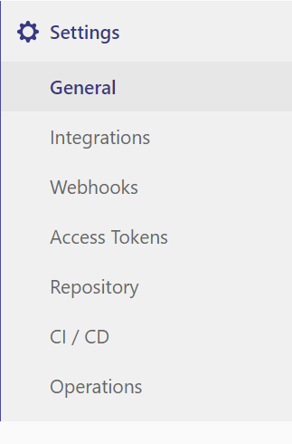

# Déclaration des droits et utilisateurs 

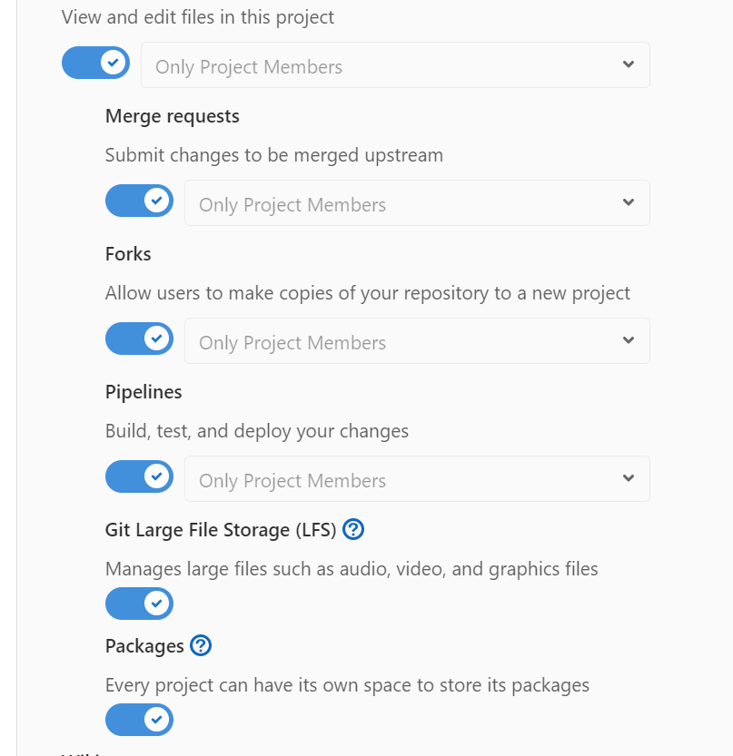

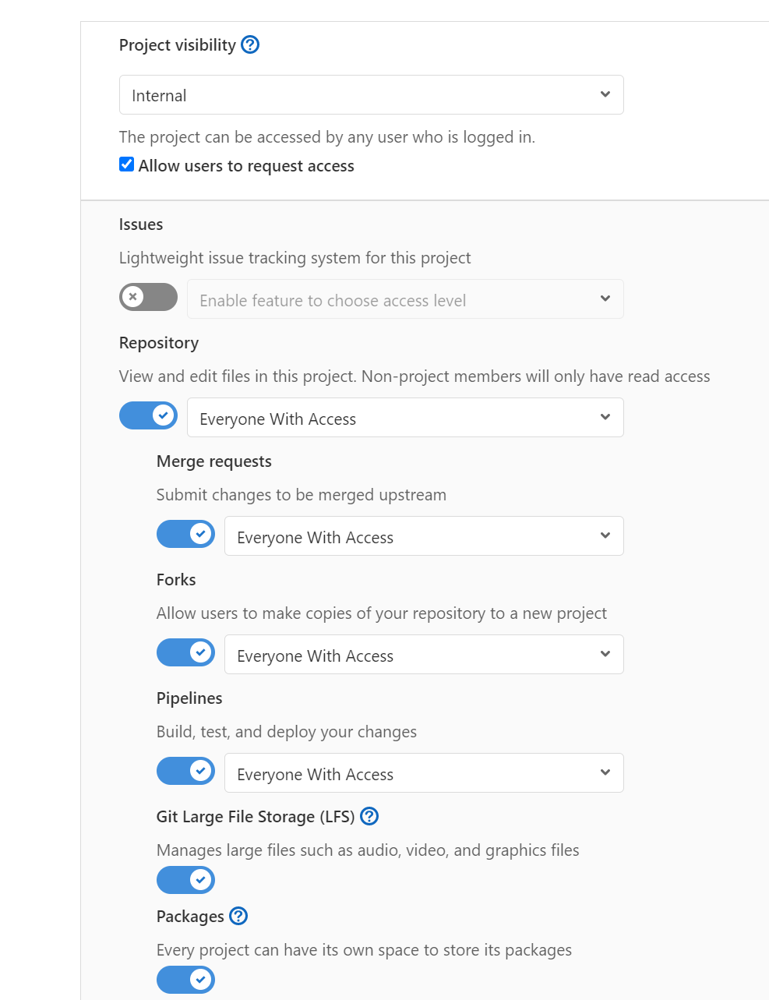

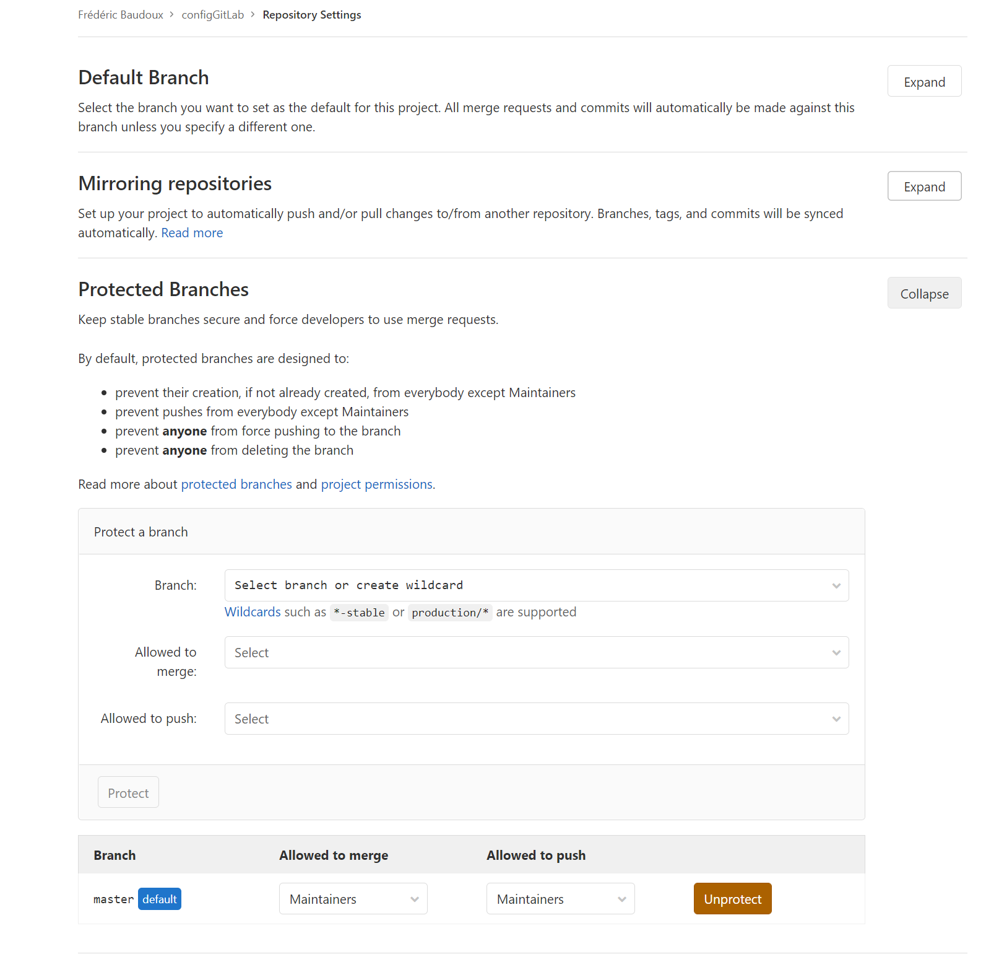

# Intégration continue 

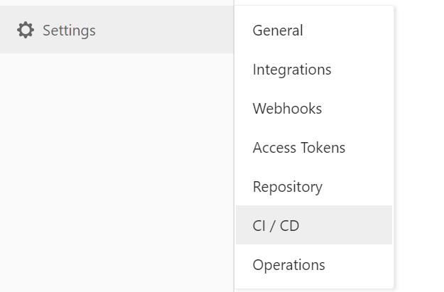

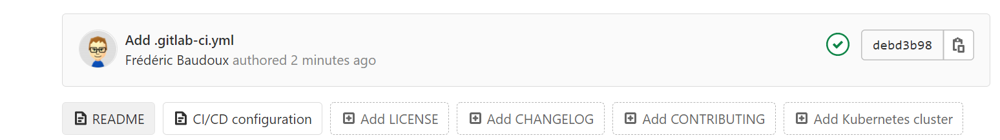

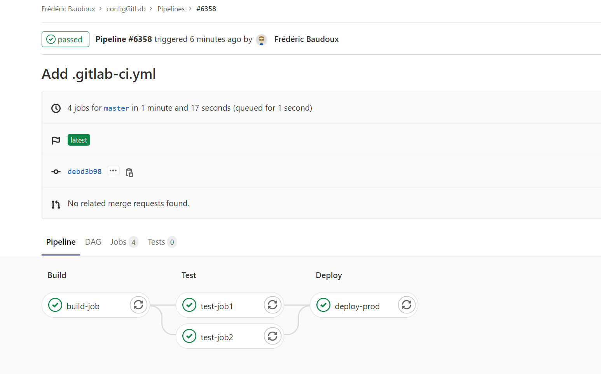

## Je déclare un runner dédié à mon projet

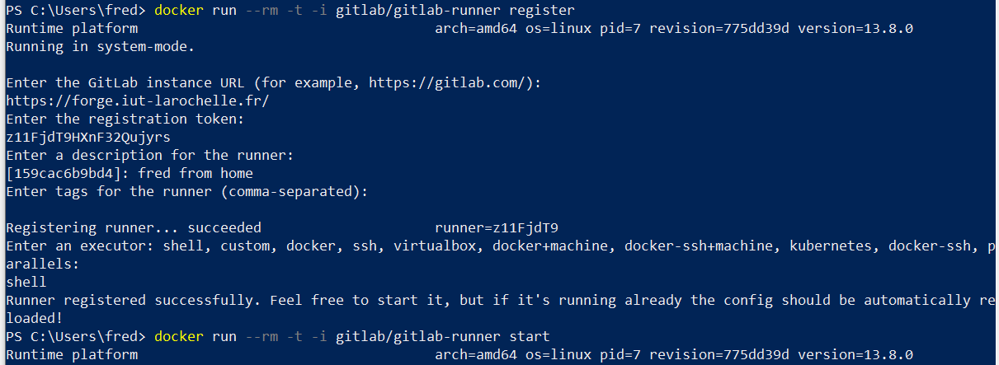

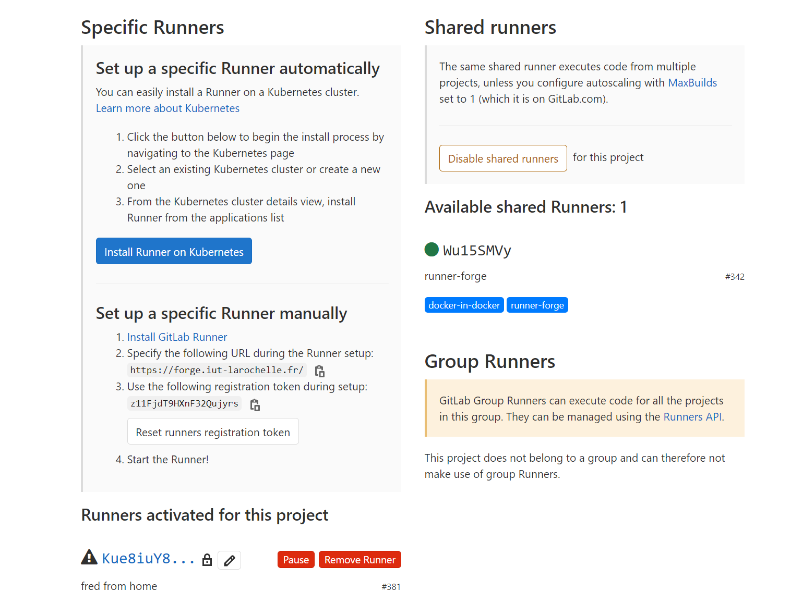

## J'utilise un vrai code source

## Je modifie mon runner dédié

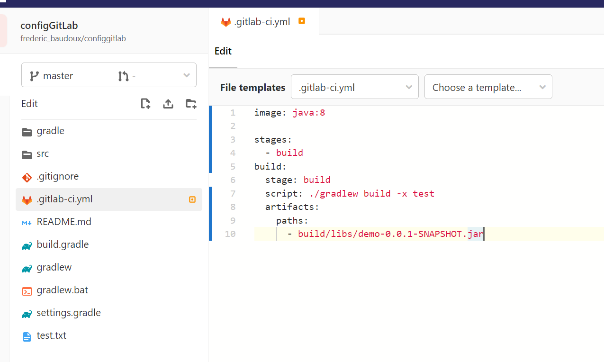

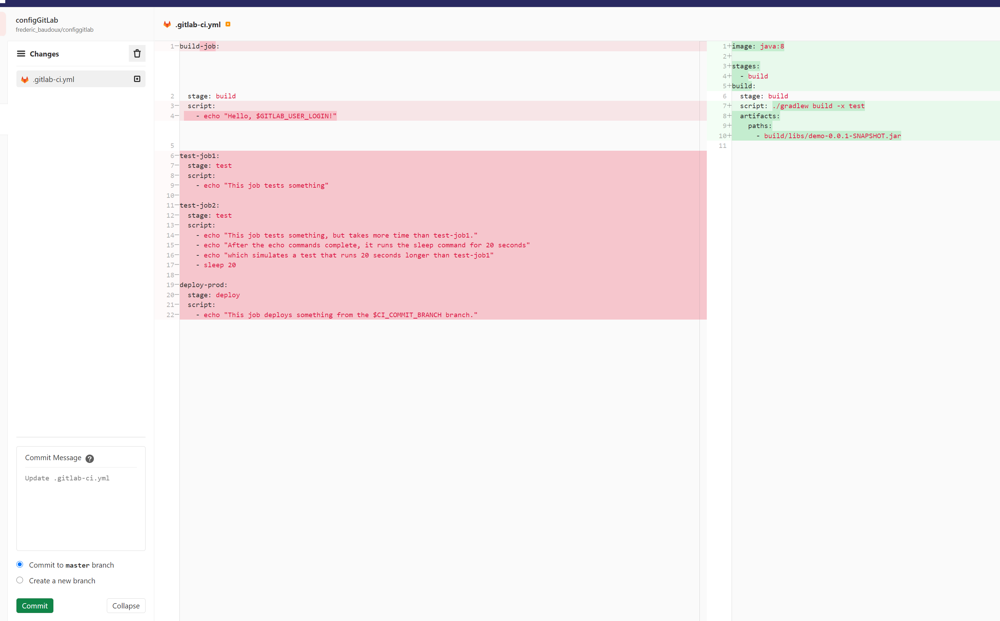

# Développement 

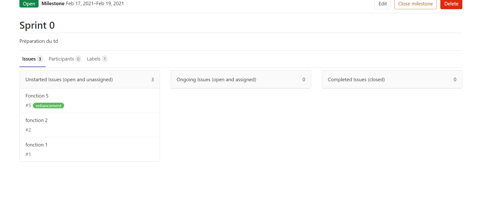

